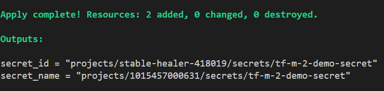

# Terraform

# Task (TF-M-2): Create Secret in Google Secret Manager

*   **Use Case:** Write Terraform code to create a Secret in Google Secret Manager. The secret's value should be a simple string (e.g., `my-super-secret-value`). Do *not* store the secret value directly in the Terraform code (use a variable, potentially loaded from a non-committed `.tfvars` file or environment variable - for the test, hardcoding with a comment explaining why it's bad practice is acceptable).
*   **Verification:** Is the Secret created? Is its lifecycle managed by Terraform?
*   **Solution:** Place in: `/Mid-Level/TF-M-2/solution_secrets.tf`

---

# *Solutions: TF-M-2 > Secret Manager with Terraform*

## Task Layout

```
Mid-Level/TF-M-2/
  ├── solution_secrets.tf   # main configuration: provider + secret + secret version
  ├── variables.tf          # input variables for project_id, region, secret_id, secret_value
  ├── outputs.tf            # outputs for secret resource ID and name
  └── README.md             

```
---

# Step-by-Step Execution

## Parameters Used

`project_id`    = (required)         > GCP Project ID where the secret is created
`region`        = europe-west1       > Region for resources 
`secret_id`     = demo-secret        > Name of the secret in Google Secret Manager
`secret_value`  = my-super-secret-value > Secret string (hardcoded for this task, not a best practice)

---

## 1. Prepared the Terraform files

**File:** `solution_secrets.tf`

```hcl
# /Mid-Level/TF-M-2/solution_secrets.tf
# Terraform configuration for Secret Manager
# defines provider, secret resource and secret version

terraform {
  required_providers {
    google = {
      source  = "hashicorp/google"
      version = "~> 5.0"
    }
  }
}

provider "google" {
  project = var.project_id
  region  = var.region
}

# the secret resource
resource "google_secret_manager_secret" "my_secret" {
  secret_id = var.secret_id
  replication {
    auto {}
  }
}

# a secret version with the value
resource "google_secret_manager_secret_version" "my_secret_version" {
  secret      = google_secret_manager_secret.my_secret.id
  secret_data = var.secret_value
}
```

---

**File:** `variables.tf`

```hcl
# /Mid-Level/TF-M-2/variables.tf
# input variables for Secret Manager configuration
# includes project_id, region, secret_id and secret_value

variable "project_id" {
  description = "GCP Project ID where the secret will be created"
  type        = string
}

variable "region" {
  description = "Region for resources"
  type        = string
  default     = "europe-west1"
}

variable "secret_id" {
  description = "The name of the secret"
  type        = string
  default     = "tf-m-2-demo-secret"
}

variable "secret_value" {
  description = "The secret value (for demo purposes only > should not be hardcoded in production)""
  type        = string
  default     = "my-super-secret-value"  # Not recommended in production
}
```

---

**File:** `outputs.tf`

```hcl
# /Mid-Level/TF-M-2/outputs.tf
# output values after secret creation
# displays secret name and resource ID

output "secret_name" {
  description = "The name of the created secret"
  value       = google_secret_manager_secret.my_secret.name
}

output "secret_id" {
  description = "The resource ID of the secret"
  value       = google_secret_manager_secret.my_secret.id
}
```

---

## 2. Navigated into the task directory

```bash
cd Mid-Level/TF-M-2
```

---

## 3. Enabled API

```bash
PROJECT_ID=stable-healer-418019

gcloud config set project ${PROJECT_ID}

# Enable Secret Manager API
gcloud services enable secretmanager.googleapis.com
```

---

## 4. Initialized Terraform

```bash
terraform fmt -recursive # automatically formats Terraform code, to run through all subdirectories
terraform init
```

---

## 5. Validated the configuration

```bash
terraform validate
```

---

## 6. Planned and Applied the configuration to create the secret

```bash
terraform plan
terraform apply -auto-approve
```

---

## 7. Viewed outputs after deployment

```bash

# to list all secrets 
gcloud secrets list
# to describe a specific secret
gcloud secrets describe tf-m-2-demo-secret
# to access the latest version of a secret
gcloud secrets versions access latest --secret="tf-m-2-demo-secret"

# or,
# outputs
terraform output
```
Outputs: 

- Secret name
- Secret resource ID



---

## Verification Notes

* `terraform init` ran successfully and downloaded the required provider.
* `terraform validate` confirmed the configuration syntax was valid.
* Running `terraform apply` created the secret in **Google Secret Manager**.
* Outputs confirmed the secret's name and resource ID.
* Terraform now manages the lifecycle of the secret. Updating or destroying is handled automatically.

---

## Additional
Hardcoding a secret value inside Terraform files was only shown for demonstration as instructed in the task description. In real scenarios, secret values should be loaded always from .tfvars files (excluded from git) or environment variables or simply .tfvars files should be kept in local machines only.

In this way, a functional **Google Secret Manager secret** was provisioned and fully managed by Terraform.

---

